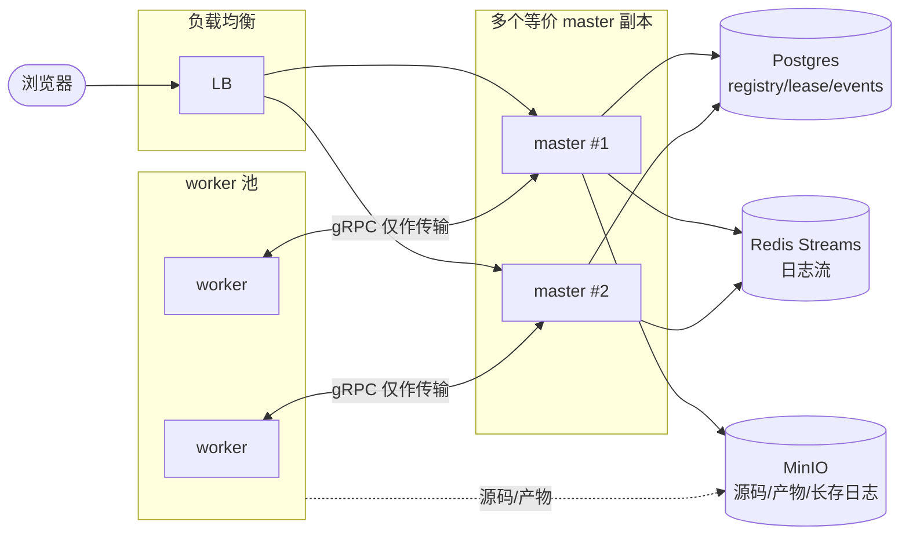
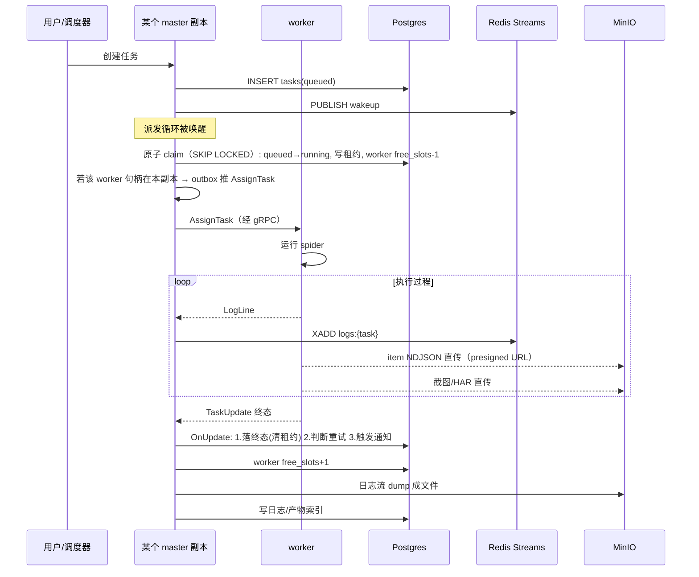

# crawler-lite v2 设计文档：无状态控制面

> 这份文档是 v1 设计（`docs/DESIGN.md`）的延续，不是替代。v1 的设计主线——把横切关注点收束到少数明确的协调点上——在 v2 里完全保留。v2 改的是 v1 里一组有硬上限的假设：**master 把协调状态放在自己进程内存里**。
>
> 阅读本文前建议先读 v1 的 `DESIGN.md`，尤其是第 2 章（设计原则）和第 7 章（单点协作速查）。v2 的所有改动都可以理解成：把 v1 的协调点从「进程内存」搬到「Postgres / Redis」，让 master 从「唯一持有真相的进程」变成「读取并推进真相的若干等价副本之一」。
>
> 仍是现阶段初步设计，简化项以「（现阶段简化：…，后续开发…）」就地标注。

---

## 1. 为什么要改

v1 是一个干净的系统，但它在「master 单实例」这个假设上收了利：只要 master 是单点，把 worker 连接表、运行中任务映射、派发循环全放在 `hub.WorkerHub` 的 Go map 里就是合理且高效的——没有跨进程同步开销，没有 lease，没有 leader 选举。

问题在于这个假设有硬上限：

1. **master 崩溃即丢状态。** `sessions` 和 `tasks` 两个 map 是纯内存。master 重启后，所有在线 worker 的会话信息丢失、所有运行中任务的「谁在跑」归属丢失。worker 还在跑，但 master 已经不知道了。v1 的 task-control 计划已经触及「worker 断连恢复」，但「master 自己死掉」不在其列。
2. **派发既不原子也不公平。** `RunDispatcher` 每 5 秒 `ListQueued` 一次，`Assign` 在 map 里取第一个 `FreeSlots > 0` 的 worker。`FreeSlots` 是心跳上报的猜测值，可能过派；也没有任何东西阻止两个 master 同时派发同一个任务——只不过 v1 没有两个 master。
3. **日志持久化是 read-modify-write。** v1 的 `DESIGN.md` 自己把它标成了「后续开发改为真正的 append」。Redis pubsub 管「实时显示」，MinIO 管「历史保存」，两套系统之间会漂移，重连补课也要各自实现。
4. **结果项（item）的字节走 master 进程进 Postgres 行。** v1 的原则是「master 不搬运大块二进制」，但 item 这条热路径并没有遵守这条原则。低量级时无所谓，量级上去就是 master 的瓶颈。

v2 不是推翻 v1，而是把这四个上限逐一拆掉，同时**不动 v1 的协调点结构**：`task.OnUpdate` 仍然是状态推进的唯一入口，`readLoop` 仍然是 worker→master 的唯一分发点，`outbox chan` 仍然是每会话的发送通道。变的是这些协调点背后的存储，不是它们的数量。



这张图和 v1 最大的区别是方向感的一个变化：**worker 连到哪个 master 都行，因为协调真相不在那个 master 的内存里，而在 Postgres 里。** master 副本之间互不知道对方，也不需要知道——它们靠同一张 Postgres 表达成一致。

---

## 2. 仍然保留的东西

先把不动的列清楚，避免讨论时把「重设计」误读成「重写」：

- **master / worker 职责切分。** master 决策与记录，worker 执行与回传。worker 仍然主动连 master。
- **gRPC 长连接作为传输。** `WorkerHub.Connect` 的 bidi stream、Hello/Welcome、心跳、`outbox` pump 这些都不变。**变的是它的角色**：从「协调真相的持有者」降级为「控制面的传输层」。下文专门讲（第 4 章）。
- **`task.OnUpdate` 的顺序不变。** 落终态 → 判断重试 → 触发通知，三条顺序仍然是铁律，仍然在 detached goroutine 上跑通知。
- **存储三件套的分工。** Postgres 管事实、Redis 管实时、MinIO 管大块。v2 只是把日志的「实时」和「历史」合并进 Redis Streams，把长存归档仍然交给 MinIO，把索引交给 Postgres。
- **Python IPC 协议。** FD 3 JSONL、`crawlerkit.runner` 入口、venv 缓存策略、captcha 硬排除——全都不动。private-python-dependencies 计划与 v2 正交，可以独立推进。
- **consumer-declared interface、cycle-via-setter、free-function handler 这些代码约定。** v2 是结构演进，不是风格变更。

一句话：**v2 改的是「真相放哪」和「派发怎么做」，不改「协调点有几个」「职责怎么分」「事件怎么流动」。**

---

## 3. 真相从内存搬进 Postgres：registry 与 lease

v2 的核心动作是让 master 在崩溃后能被任意一个等价副本接管。要做到这点，worker 连接信息和运行中任务归属必须是**持久化且可恢复**的。

### 3.1 worker 注册表

新增 `workers` 表（v1 没有这张表，worker 只活在 hub 内存里）：

```text
workers
  id              TEXT PRIMARY KEY      -- 稳定 id（hostname 或 env WORKER_ID）
  version         TEXT
  concurrency     INTEGER NOT NULL
  capabilities    JSONB NOT NULL         -- ["python3.12","chromium","selenium"]
  status          worker_status          -- 'online' | 'draining' | 'offline'
  last_seen       TIMESTAMPTZ NOT NULL   -- 心跳时间戳，由 master 周期写回
  free_slots      INTEGER NOT NULL       -- 心跳上报，派发用
  running_tasks   INTEGER NOT NULL       -- 心跳上报
  registered_at   TIMESTAMPTZ NOT NULL DEFAULT now()
```

这张表由两条路径写入：

- **worker 连接 master 时 upsert。** master 的 `Connect` 处理完 Hello 之后，把 worker 写进 `workers`（`status='online'`）。这是注册表的真相来源——只要 worker 连着某个 master，它在表里就是 online。
- **心跳更新。** master 收到 `Heartbeat` 后，`UPDATE workers SET last_seen=now(), free_slots=..., running_tasks=...`。

注意：**「在线」的判定不再依赖 master 内存里的 session map，而依赖 `workers.status='online'` 且 `last_seen` 新鲜。** 这样 master 死了也不丢「哪些 worker 存在、各自多少容量」的事实。

（现阶段简化：`workers` 表的清理仍由 hub 的 `unregister` 触发——会话断开时写 `status='offline'`；后续开发引入一个独立的 reaper goroutine，按 `last_seen` 超时把僵尸 worker 标 offline，不依赖断连事件，因为 master 崩溃时不会发出断连事件。）

### 3.2 运行中任务的 lease

v1 里「任务在哪个 worker 上跑」存在 `hub.tasks` map。v2 把它搬进 `tasks` 表的两列：

```text
tasks（新增列）
  worker_id       TEXT      -- 已有列，v2 真正使用：持有时 = 运行归属
  lease_expires_at TIMESTAMPTZ -- v2 新增：租约到期时间
```

派发一个任务 = 在一个事务里把它从 `queued` 改成 `running`、写入 `worker_id`、写入 `lease_expires_at = now() + timeout_s + grace`。这个写入就是「派发」本身——见第 5 章。

租约的含义是：**「我授权这个 worker 跑这个任务，授权到 T 时刻；T 之后任何 master 都可以认为这个任务成了孤儿，重新派发。」** 这是 v2 处理 master 崩溃和 worker 静默死亡的核心机制：

- master 收到 worker 的终态 `TaskUpdate` 时，清空 `lease_expires_at`，任务进入终态。
- worker 健康运行期间，周期性心跳让 master 续租（`UPDATE tasks SET lease_expires_at = now() + ... WHERE id=? AND worker_id=? AND status='running'`）。
- 任何 master 的 reaper goroutine 扫到 `status='running' AND lease_expires_at < now()` 的任务，就把它回收：重新置 `queued`（或按策略 `failed`）并清空 `worker_id`，等下一轮派发。

租约把「worker 是否还活着」和「任务是否还有主」解耦了：worker 心跳是续租的来源，但即使 worker 不再心跳、或 master 崩过，**只要租约没到期，任务就归属不变；一旦租约到期，真相自动可恢复。** 这比 v1 靠内存 map + 断连事件恢复要鲁棒得多。

（现阶段简化：续租的 grace 和回收后的目标状态（re-queue 还是直接 failed）是固定值；后续开发按 spider 配置的 retry 策略决定，并把「被回收」作为一种可重试的 err_class。）

---

## 4. hub 从「真相持有者」降级为「传输层」

v1 的 `WorkerHub` 同时干两件事：管理会话/任务真相（map），以及承载 gRPC 收发。v2 把前一件卸掉，只留后一件。

`Connect` 的流程基本不变（Hello→Welcome→readLoop + outbox pump），但：

- **`sessions` map 退化为「当前 master 副本持有的连接句柄」**，仅用于本副本知道往哪个 outbox 推 `AssignTask`/`CancelTask`。它不再是系统级真相。一个 worker 连着 master #1，对 master #2 来说它是「表里 online、但在我这儿没有句柄」——这完全正常。
- **`tasks` map 删除。** 「任务在哪个 worker」改读 `tasks.worker_id`。
- **`Assign` 不再在内存里挑 worker。** 派发决策移到第 5 章的原子 claim。hub 只负责把已经决定好的 `AssignTask` 推到对应 worker 的 outbox——而「对应 worker」由 claim 事务的结果（`tasks.worker_id`）反查 session map 得到。如果该 worker 的句柄不在这个 master 副本上，这个 master 就不推，由持有句柄的副本在下一轮派发时推，或由 leader 推（见第 6 章）。
- **`CancelRunning` 不再查内存 map。** 它读 `tasks.worker_id`，找到该 worker 的句柄；若在本副本就推 `CancelTask`，否则跳过——取消的真相是 DB 里的 `cancelled` 状态，不是「消息推没推出去」。worker 侧在下一次心跳/任务交互时也会发现任务已被取消。

这个降级是 v2 最微妙的地方：gRPC 长连接仍然是高效的传输，但它**不再承载正确性**。正确性全在 Postgres，连接只负责「快」。连接断了、master 崩了、worker 重连到另一个 master——都只影响「这一刻的消息推得多快」，不影响「这个任务最终归谁、状态是什么」。

（现阶段简化：AssignTask 的实际推送仍由持有句柄的 master 副本做，通过定期派发循环覆盖；后续开发引入跨副本的「转发提示」（副本 A 派发后发现句柄在副本 B，发一条内部 Pub/Sub 通知 B 立即推），减少派发到真正下发的延迟。）

---

## 5. 派发：从 poll + first-fit 到原子 claim

v1 的 `dispatchOnce` 是「读所有 queued → 逐个问 hub 要不要 Assign → hub 在内存里 first-fit」。v2 换成一个数据库事务里的原子 claim。

### 5.1 一次 claim

派发循环每次跑这段（伪 SQL）：

```sql
BEGIN;
-- 锁住一批到期的 queued 任务，跳过被别人锁住的
SELECT id, spider_id, spider_version
  FROM tasks
 WHERE status = 'queued'
   AND (not_before IS NULL OR not_before <= now())
 ORDER BY queued_at
 LIMIT $batch
 FOR UPDATE SKIP LOCKED;

-- 对每个选中的任务，找一个有容量的 online worker
SELECT w.id, w.free_slots, w.capabilities
  FROM workers w
 WHERE w.status = 'online' AND w.free_slots > 0
   AND ($required_caps <@ w.capabilities)   -- 能力过滤
 ORDER BY w.free_slots DESC NULLS LAST      -- least-loaded
 LIMIT 1;

-- 占用：任务转 running + 写租约；worker 容量 -1
UPDATE tasks
   SET status='running', worker_id=$w, lease_expires_at=now()+timeout+grace, started_at=now()
 WHERE id=$t;
UPDATE workers SET free_slots = free_slots - 1 WHERE id=$w;
COMMIT;
```

要点：

- **`FOR UPDATE SKIP LOCKED` 让多个 master 副本可以同时派发而互不冲突、不重复。** 一个任务被某副本锁住，其他副本跳过它去派别的。这天然解决了 v1「两个 master 会双派」的隐患。
- **first-fit 升级为 least-loaded + 能力感知。** `ORDER BY free_slots DESC` 选最空闲的 worker，`<@`（数组包含）做能力过滤。v1 DESIGN.md 里「后续开发引入 least-loaded / 能力感知选择」这一项，在这里一次性落地。
- **slot 计量从「心跳猜测」变成「claim 本身的计数」。** `free_slots` 在 claim 时原子 `--`，在终态/回收时原子 `++`。worker 心跳上报的 `free_slots` 只用于校准（防止 worker 自报与 master 计数漂移）。v1 task-control 计划里「心跳时序导致过派」的 slot 计量 bug 在这里根除。
- **租约就是派发的产物。** 不存在「派发了但还没拿到租约」的中间态——一个事务要么全做要么全不做。

### 5.2 派发循环的位置

`RunDispatcher` 仍然是那个 5 秒 tick + wakeup 的循环（结构不变），但它的 `dispatchOnce` 内部从「调 hub.Assign」变成「执行上面的 claim 批事务，然后对每个 claim 成功的任务 `buildAssign` 并推到对应 worker 的 outbox（若句柄在本副本）」。leader gate（第 6 章）决定「这个副本要不要跑派发循环」。

### 5.3 谁去推 AssignTask

claim 事务把 `tasks.worker_id` 设好了，但「把 AssignTask 消息真正发到那个 worker」需要该 worker 的 gRPC 句柄。三种情况：

1. 句柄在本副本：直接 `outbox <- assign`。
2. 句柄在另一副本：本副本什么都不做。持有句柄的副本会在它自己的下一轮派发扫描里发现「这个任务是 running、worker 是 W、但我还没给 W 推过 assign」（用一个「已下发」标记列区分），然后推。
3. 该 worker 当前没有任何副本持有句柄（短暂断连）：等它重连，重连的副本在「补下发」扫描里推。

（现阶段简化：用一个 `tasks.assign_sent` BOOL 列标记「AssignTask 是否已真正下发」，由持有句柄的副本在派发扫描里补发；后续开发用跨副本 Pub/Sub 即时通知，消除补发延迟。）

---

## 6. 多副本 master 与 leader gate

v2 让 master 可水平扩容：N 个 master 副本挂在 LB 后面，浏览器和 worker 都经过 LB。但有两件事不能多副本同时做：

1. **定时调度。** `schedule.Runner` 的 cron 不能有两个副本同时跑，否则每次到点产生两个任务。v1 靠「只有一个 master」隐式保证。
2. **派发循环的 reaper 部分。** 多副本同时扫过期租约并回收是安全的（claim 用 SKIP LOCKED 互斥），但为了减少无用竞争，可以只让 leader 跑 reaper。

v2 用一个 **Postgres advisory lock** 做领导选举：

```go
// leader 副本持有 pg_try_advisory_lock(LEADER_KEY)，周期性续。
// 持有期间：跑 schedule.Runner + reaper goroutine。
// 失去锁（DB 抖动 / 副本死亡）→ 释放，等其他副本抢占。
```

- **API 和 gRPC 不需要 leader。** 任何副本都能处理用户的查询、创建任务、取消任务。`Queue` 只是往 `tasks` 插一行 queued——任何副本都能做，wakeup 信号通过一个跨副本通道传递（见下）。
- **派发循环本身可以所有副本都跑**（因为 claim 是 SKIP LOCKED 原子的，多跑只是分摊工作），也可以限制为只 leader 跑。v2 选「所有副本都跑派发」以降低派发延迟，但 reaper（租约回收）只 leader 跑，避免对孤儿任务的多副本争抢。
- **wakeup 跨副本。** v1 的 `wakeup chan` 是进程内的，副本 A 上的 `Queue` 叫不醒副本 B 的派发循环。v2 改用 Redis：`Queue` 后 `PUBLISH` 一条 wakeup（或 `LPUSH` 到一个 wakeup list），所有副本的派发循环 `SUBSCRIBE`/`BLPOP`。5 秒 tick 仍作为兜底。

（现阶段简化：leader gate 用单把 advisory lock，无 fenced token；后续开发在 lease 写入时带上 leader epoch，防止脑裂期旧 leader 的误写。）

advisory lock 的好处是它**不引入新组件**——v1 已经依赖 Postgres，v2 只是多用了它一个能力。坏处是 leader 切换时调度有短暂空窗（秒级），这对爬虫调度是可接受的。

---

## 7. 日志：Redis Streams 统一实时与回放

v1 的日志走两套：Redis pubsub（实时扇出）+ MinIO read-modify-write（历史）。v2 用 **Redis Streams** 把两者合并。

### 7.1 一个流 = 一个任务的全部日志

每个任务一个 Stream，key 形如 `logs:{task_id}`。worker 把每条 `LogLine` 通过 master `XADD` 进流：

```text
XADD logs:42 * level INFO ts_ns 1720... line "fetched 30 items"
```

- **天然 append。** Streams 是追加写，没有 read-modify-write。v1 DESIGN.md 标的「后续开发改为真正的 append」在这里落地。
- **天然有序、有 ID。** Stream entry ID 是单调递增的时间戳，天然就是日志顺序，重连后用 `XREAD` 的 `last` 游标续读，不丢不重。
- **天然支持回放。** 浏览器打开任务页时：先 `XRANGE logs:42 - +` 拉历史，再用 `XREAD BLOCK` 从最后一条 ID 续实时。v1 需要「先订阅 Redis 再回放 MinIO 且小心不漏」的精细顺序，v2 里这两步是同一个流上的连续游标，不可能漏。

### 7.2 与 MinIO / Postgres 的关系

Stream 不是永久存储——它有容量上限（`MAXLEN ~ N`）或 TTL。长期归档仍然落 MinIO，索引仍然落 Postgres。三者分工变成：

- **Redis Stream：** 最近 N 条 + 实时尾随。负责「现在能看到」和「最近能回放」。
- **MinIO：** 任务结束后，把整条流（或流中超出 MAXLEN 的部分）落成一个 NDJSON 日志文件。负责「很久以后还能回放」。
- **Postgres：** 日志索引（行数、字节数、级别统计、MinIO key），不变。

也就是说 Stream 替换的是 v1 的「Redis pubsub + MinIO RMW append」这一段，MinIO/Postgres 的角色不变，只是写入路径从 RMW 变成「流结束时一次性 dump」。

（现阶段简化：流在任务终态时整体 dump 到 MinIO；后续开发做「流满 MAXLEN 就滚动 dump」以支撑超长日志任务，并保留 Stream 中最近的窗口供即时回放。）

### 7.3 LogSink 的实现变化

`hub.LogSinkPubsub` → `hub.LogSinkStream`：`Write` 改成 `XADD`，去掉内存缓冲和定时 flush（流自带批量化语义）。`Run` 里那个 flush goroutine 可以删掉。浏览器侧的 WebSocket handler 从「订阅 Redis channel + 回放 MinIO」改成「`XRANGE` + `XREAD BLOCK`」。

---

## 8. 结果项（item）：不再每行进 Postgres

v1 的 `ItemSink` 把每个 item 的 JSON 作为一行写进 `items` 表。v2 把 item 的字节路径从 master 进程里挪走，方式与截图/HAR 一致：**worker 用 presigned URL 直传对象存储，Postgres 只存索引。**

### 8.1 两条可选路径

1. **NDJSON 对象 + 索引行。** worker 把 item 们追加写进 MinIO 的 `items/{task_id}.ndjson`，每个任务一个对象；任务结束时（或定期）Postgres 写一条索引：`items(task_id, count, bytes, storage_key)`。适合「只关心整批结果」的场景。
2. **保留行级 items，但走批量/异步写。** 如果查询模式需要按字段过滤单条 item，保留行级表，但 `ItemSink` 改成内存攒批 + 批量 `INSERT`，且**字节不走 master**——worker 先把 item NDJSON 传 MinIO，master 只从对象存储读索引化所需字段。这条更复杂，仅当真有按字段查询单条 item 的需求才上。

（现阶段简化：默认走路径 1（NDJSON + 索引行），因为它最符合 v1「master 不搬运大块二进制」的原则，也最简单；后续开发若 UI 需要分页浏览单条 item，再评估路径 2。）

这个改动让 master 的 item 热路径从「每条 item 一次 Postgres 写」降到「每任务一次对象存储写 + 一次索引写」，与截图/HAR 的处理对齐。

---

## 9. 端到端信息流（v2 版）



对比 v1 的端到端流，最后三步的顺序（落终态 → 重试 → 通知）完全不变。变的是中间：派发是原子 claim 而非内存 first-fit；日志进 Stream 而非 pubsub+RMW；item 直传 MinIO 而非经 master 进 Postgres。

---

## 10. 失败与恢复：逐场景对照

v2 的价值最好用「出问题时会怎样」来看：

| 场景 | v1 行为 | v2 行为 |
|---|---|---|
| master 崩溃重启 | 丢失全部 session/任务归属；运行中任务成孤儿，worker 续跑但无人知 | 任何副本接管；`workers` 表与 `tasks.worker_id`+`lease_expires_at` 仍在；reaper 在租约到期后回收孤儿任务重新派发 |
| worker 静默死亡（进程没了） | hub 靠 gRPC 断连事件 unregister；运行中任务靠 worker 自报，永远卡 running | 心跳停 → `last_seen` 过期 → reaper 标 worker offline；租约到期 → 任务回收重派 |
| 两个 master 副本同时派发 | （v1 无此场景） | `FOR UPDATE SKIP LOCKED` 保证一个任务只被一个副本 claim，不会双派 |
| 定时调度 + 多副本 | （v1 无此场景） | advisory lock 选 leader，只有 leader 跑 cron，不会双发 |
| master 派发时 worker 句柄在别的副本 | （v1 无此场景） | 本副本只写 DB 真相（running+租约）；`assign_sent` 标记未下发；持句柄副本在补发扫描里推 AssignTask |
| 日志重连补课 | 需「先订阅 Redis 再回放 MinIO」的精细顺序，易漏 | 同一个 Stream 上 `XRANGE` + `XREAD`，游标连续，不丢不重 |
| 日志量极大 | MinIO RMW append 读写放大 | Stream 原生 append；超长任务滚动 dump 到 MinIO |
| item 高量级 | 每条 item 一次 Postgres 写，走 master 进程 | worker 直传 MinIO NDJSON，master 只写索引 |

这张表是 v2 设计的验收清单：每一行都是 v1 的一个真实上限，v2 给出了对应机制。

---

## 11. 部署形态的变化

- **开发环境：** 仍然本地起 Postgres/Redis/MinIO + master + worker + 前端。可以只起单 master（advisory lock 无竞争、claim 无并发），行为与 v1 等价。这是 v2 的一个重要性质——**单副本时 v2 退化为 v1 的行为**，开发体验不退化。
- **生产环境：** master 改为 `--scale master=N`，前置 LB（现有 nginx/devops 可复用）。worker 仍 `--scale worker=N`，连 LB 的 gRPC 端口（而非某个固定 master）。`workers` 表与 lease 让扩缩 master 不再是架构操作。
- **leader 与调度：** 任一副本都可能成为 leader；leader 挂了秒级切换，调度空窗可接受。
- **生产硬化项沿用 v1 清单：** CORS 收紧、bcrypt cost、module path 改名、SSH git auth 等，与 v2 正交，按 v1 节奏推进。

（现阶段简化：LB 假定支持 gRPC 长连接的负载均衡（nginx/grpc 或 Envoy）；后续开发在部署文档里给出 LB 的具体 keepalive 配置，并补 worker 侧「重连时优先选最少连接的 master」的策略。）

---

## 12. 与两个在进行的计划的关系

- **task-control-feature-plan（master 主控任务生命周期）：** v2 是它的超集。该计划要的「worker 断连恢复」由 lease + reaper 覆盖；「取消权威性」由「真相在 DB 状态、取消即写 cancelled」覆盖；「timeout 即使 worker 死也生效」由租约到期覆盖；「slot 计量修正」由原子 claim 的 `free_slots` 计数覆盖；「scheduler overlap 控制」是 schedule 层策略，与 v2 正交，照该计划做即可。**结论：该计划在 v2 里自然实现，不需单独推进。**
- **private-python-dependencies-plan：** 完全正交。它改的是 worker 的 venv/依赖安装，不动协调状态。v2 不影响它，它也不影响 v2。**结论：照该计划独立推进。**

---

## 13. 单点协作速查（v2 更新）

v1 第 7 章那张表里，几行在 v2 有了变化，标注如下：

| 事情 | v1 协调点 | v2 协调点 | 变化 |
|---|---|---|---|
| 任务状态变化 | `task.OnUpdate` | `task.OnUpdate` | 不变（顺序也不变） |
| 任务派发 | hub 内存 first-fit | Postgres 原子 claim（SKIP LOCKED） | 从内存搬进 DB，多副本安全 |
| worker 在线/容量 | hub `sessions` map | `workers` 表 | 从内存搬进 DB，可恢复 |
| 任务运行归属 | hub `tasks` map | `tasks.worker_id` + `lease_expires_at` | 从内存搬进 DB，租约可回收 |
| 定时调度唯一性 | 单 master 隐式保证 | advisory lock leader | 显式 leader 选举 |
| 派发 wakeup | 进程内 chan | Redis Pub/Sub | 跨副本 |
| Python 事件进 Go | worker 事件读取管道 | 不变 | — |
| worker→master 收消息 | 每 session readLoop | 不变 | — |
| master→worker 发消息 | 每 session outbox | 不变（但只在本副本有句柄时推） | 传输不变，真相在 DB |
| 日志实时+回放 | Redis pubsub + MinIO RMW | Redis Streams（单一） | 两套合一，原生 append |
| HTTP 返回 / DB 访问 / 前端请求 | render / repository / api client | 不变 | — |

这张表是 v2 改动的全集：变的全是「真相从内存搬进 DB/Redis」，没变的是协调点的数量和职责边界。v1 的工程克制——把入口和边界定义清楚——在 v2 里通过「让真相持久化」获得了水平扩展和崩溃恢复能力，而无需新增协调点。
