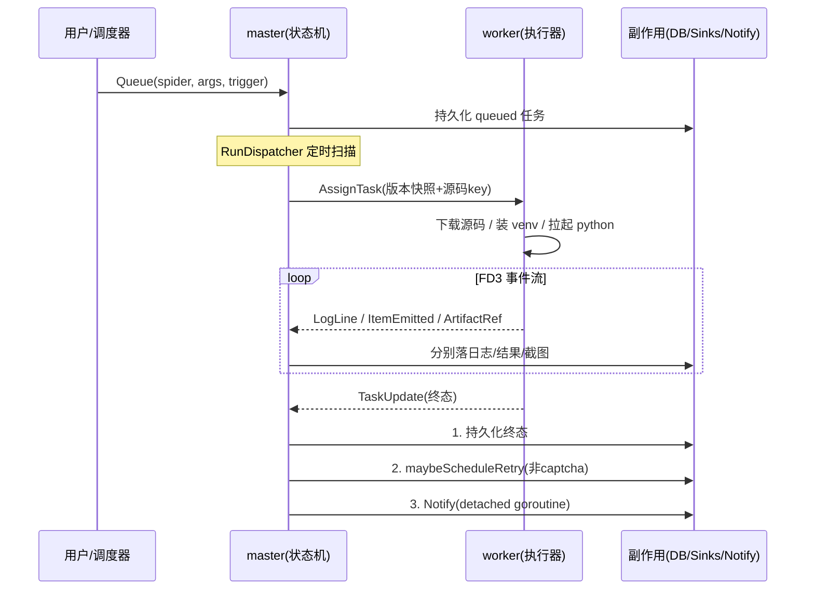

# crawler-lite 设计文档

> 本文讲系统的**设计意图与架构原则**，不逐文件罗列实现。配合 `CLAUDE.md` 的约定章节阅读。
> module path 仍为占位符 `github.com/yourteam/crawler-lite`，尚未改名。

---

## 1. 概述

crawler-lite 是一个面向 Python + Selenium 爬虫的**托管运行平台**。它要解决的核心问题是：把"一段会抓网页、会遇验证码、要定时跑、要把结果存下来"的爬虫脚本，变成一个可调度、可观测、可重试、可水平扩展的服务。

设计上它刻意分成两类职责截然不同的进程：

- **master**：系统的"大脑与门面"。唯一持有数据库连接、唯一对外暴露 API、唯一做调度决策。它不碰爬虫代码本身。
- **worker**：系统的"手脚"。只做一件事——按 master 的指令，在一个隔离的子进程里跑 spider 的 Python 代码，并把过程实时回传。worker 无状态、可随意水平扩展。

两者之间是**一条长连接双向 gRPC 流**，由 worker 主动连接（NAT 友好，worker 可在任意位置拉起）。这种"控制面（master）与执行面（worker）分离、用流式协议连接"的形态，是整个系统所有后续设计的起点。


信息流的方向是单向收敛的：**所有状态变更最终都汇集到 master 的任务状态机，所有执行都从 master 的调度决策流出**。worker 永远不直接写库、不直接接外部请求。

---

## 2. 设计原则

系统在多个层面反复践行同一条原则，理解它就能预测大部分实现选择：

> **每个横切关注点只有一个咽喉（chokepoint）。任何想绕过咽喉、新开第二条路径的代码都是 bug。**

这条原则派生出几个具体表现：

| 原则 | 落地 |
|---|---|
| 状态推进单入口 | 任务状态机只有 `task.OnUpdate` 一个入口；"第二处推进任务状态的地方就是 bug" |
| 顺序不可变 | `OnUpdate` 内部固定为：**持久化状态 → 重试决策 → 触发通知**，绝不可重排 |
| 副作用与主流程解耦 | 通知在 detached `context.Background()` goroutine 上跑，慢 webhook 不能反压状态落库 |
| 消费者声明接口 | 接口写在调用方而非实现方，使每个服务可就近用 inline mock 单测 |
| 控制面无状态执行面 | worker 不持业务状态，靠 `os.Hostname()` 兜底身份，`--scale worker=N` 即可扩容 |
| 前向不可逆 | 数据库迁移前向 only，跨边界回滚需手工介入 |

这条"咽喉"原则是系统可推理性的根基：因为每个关注点只有一条路径，调试时只需顺着那一条路径走，不必担心有旁路在悄悄改状态。

---

## 3. 进程与职责边界

### 3.1 master：控制面

master 把自己组织成一个**严格分层的构造根**（`app.Build`），自顶向下五段：基础设施 → 仓库 → 领域服务 → hub + sinks → 网络面。没有 DI 容器，构造函数手动注入依赖，读 `app.go` 即可看清谁依赖谁。

它承担四类职责：

1. **门面**：HTTP API + 内嵌 SPA（go:embed），含鉴权中间件。API 404 永远返回 JSON，SPA fallback 只对未匹配路由生效——二者绝不互相遮蔽。
2. **调度**：进程内 cron daemon，到点把"该跑的 spider"变成"queued 任务"交给状态机。
3. **状态机**：`task.OnUpdate` 是唯一推进点，串联状态持久化、重试决策、通知。
4. **分发**：`RunDispatcher` 定时泵扫 queued 任务，first-fit 分配给有空闲槽的 worker。

### 3.2 worker：执行面

worker 的生命周期很薄：连接循环（指数退避）→ 鉴权 Hello → 拿到 Welcome → 跑两个循环（心跳 + 收消息）+ 一个 outbox 通道。真正干活的是 `TaskExecutor`，它把"跑一段爬虫代码"这件事固化成一条标准流水线：

```
下载源码 zip → 解压到隔离工作目录 → 按 requirements 哈希装 venv
   → 拉起 python 子进程(FD3 当事件管道) → 泵事件 → 等退出 → 分类结局
```

两个关键设计：

- **venv 按 `requirements.txt` 哈希缓存**，per-hash 互斥锁串行化。相同依赖的 spider 复用同一个 venv，避免每次重装。
- **结局分类是纯函数**，且 **captcha 覆盖一切**：哪怕 Python 进程干净退出，只要事件流里出现过 captcha，就判为 `captcha_blocked`。因为 captcha 是操作员态问题，不是瞬时故障。

### 3.3 Python SDK：执行契约

master/worker 都是 Go，但跑的爬虫是 Python。两侧用一个**进程间契约**对接，而不是嵌入式解释器：

- 入口：`entry_module = "pkg.mod:ClassName"`，runner 反射加载
- 通信：**FD 3 上的 JSONL 事件流**，每行一个 `{type, data}`（log / item / shot / captcha）
- 配置：通过环境变量注入（任务 id、spider id、事件 fd、config、args）
- 退出码：约定 0/1/2/130 分别表示成功/未捕获异常/无入口/SIGINT

选 FD 3 而非 stdout，是为了把**结构化事件**和**人看的 print 日志**分到两条管道，互不污染。stdout 仍被 worker 收集转成 INFO 日志，让用户调试用的 `print()` 也能在 UI 看到。

---

## 4. 核心抽象

### 4.1 任务：系统的中心实体

任务是贯穿全系统的中心抽象。一个任务 = "在某版本 spider 上、以某参数、做一次运行尝试"。它的状态机有七个终态/中间态（queued → running → succeeded/failed/cancelled/timeout/captcha_blocked），触发方式四种（manual / schedule / retry / api）。

任务携带 `spider_version`——这是**不可变快照**语义：spider 源码可以随时 sync 更新，但已排队的任务始终跑它入队那一刻的版本。这让"边改爬虫边跑历史任务"不会产生不可复现的结果。

### 4.2 spider：可变定义 + 不可变快照

spider 本身是可变定义（名称、入口、git 源、config），但每次 sync 会产出新的 `source_version`，源码以 zip 形式存进 MinIO。任务引用版本号而非当前源码，于是"定义可变"与"执行可复现"两个诉求被解耦。

### 4.3 调度与任务的桥接

调度器不直接跑爬虫。它只做一件事：到点时调用任务状态机的 `Queue`，创建一个 `trigger=schedule` 的任务。**从这一刻起，调度触发的任务和人工点的任务走完全相同的链路**。这是"咽喉"原则的又一体现：调度只是任务的一种触发来源，不是一条独立执行路径。

### 4.4 重试：纯函数策略

重试决策被抽成纯函数 `Decide(attempt, errClass)`，输入是尝试次数与错误类别，输出是"是否重试 / 延迟多久"。**captcha 硬排除**——它不是瞬时故障，重试只会再次撞墙，必须人介入。把策略做成纯函数，意味着可以脱离整个运行时做确定性的单测，也意味着未来换策略只需替换这一个函数。

### 4.5 通知：终态订阅

通知系统订阅任务的终态事件（failed / timeout / captcha_blocked / 可选 succeeded），通过 shoutrrr 转发到 slack/telegram/discord 等。它挂在状态机的最后一步、跑在 detached goroutine 上——所以通知失败永远不会让一个本已成功的任务"看起来没成功"。

---

## 5. 端到端信息流

一次完整的"定时抓取并通知"链路：



注意状态机内部那三步的顺序：**先落库，再决定重试，最后通知**。这个顺序保证了一致性——即使通知那一刻 master 崩了，任务的真实状态已经在库里，重启后 dispatcher 会把该重试的重新排进队列。

---

## 6. 横切关注点的咽喉汇总

| 关注点 | 咽喉 | 为何重要 |
|---|---|---|
| 任务状态推进 | `task.OnUpdate` | 唯一入口，保证状态/重试/通知顺序固定 |
| Python→Go 事件 | FD3 `pumpEvents` | 单一解析点，结构化与日志分流 |
| worker→master 消息 | 每 session 一个 `outbox chan` | 序列化 + 背压 |
| master←worker 消息 | `readLoop` | 单一读循环分发到各 sink |
| HTTP 响应 | `render` 包 | 唯一响应信封与错误格式 |
| DB 访问 | `repository.Repos` bag | 统一列常量 + scan 映射 |
| 前端 fetch | `api<T>()` | 唯一封装：注 token、抛 ApiError、401 登出 |

每一行都是"想加第二条路径时会被 review 拦下"的位置。

---

## 7. 部署形态

- **开发**：docker 起三件套（postgres/redis/minio），master/worker/web 各一终端，Vite 代理 `/api`（含 WebSocket）到 master。
- **生产**：同一份 compose 叠加 prod override；master 单实例（持有调度器与状态机），worker `--scale` 任意扩。
- **管理员**：无 UI，靠命令行哈希口令 + 手工 SQL 插入。

worker 无状态 + 主动连 master 的设计，让扩容变成纯粹的"多起一个副本"，无需改 master 配置、无需服务发现。

---

## 8. 设计权衡与已知限制

- **控制面单点**：master 是单实例，持有调度器与状态机。简化了正确性（无需分布式 cron / 分布式状态机），代价是 master 需要高可用时要做主动-备切换。当前阶段是可接受的取舍。
- **鉴权简化**：worker 用单一 `WORKER_SHARED_SECRET`，适合受信内网；公网/多租户前需 per-worker 凭证或 mTLS。
- **批量操作走前端组合**：列表批量删除是前端对单条 `DELETE` 做 `Promise.all`，非原子、N 次请求。大列表场景下是可见的当前取舍。
- **迁移前向 only**：用不可逆性换简单性，回滚需人工。
- **captcha 是人**：硬排除重试，把"机器搞不定"的情况显式留给操作员。
- **README 与代码不符**：README 提到 `chi`，实际 HTTP 框架是 gin——以 `go.mod` 为准。

---

## 9. 演进方向

1. **改名 module path** 为真实组织路径（当前是占位符）。
2. **master 高可用**：若要消除控制面单点，需引入分布式 cron 选主 + 状态机幂等，复杂度显著上升，应按需推进。
3. **批量/原子 API**：当批量操作变重，补后端原子端点，并把前端列表选择/工具栏抽成共享组件（当前两页有重复）。
4. **typed spider config**：当前 `config` 是 free-form map，字段稳定后落成 typed struct 以获得校验。
5. **可观测性**：outbox 背压、venv 安装耗时、captcha 率等可补 metric，让"咽喉"处的健康度可被观测。
