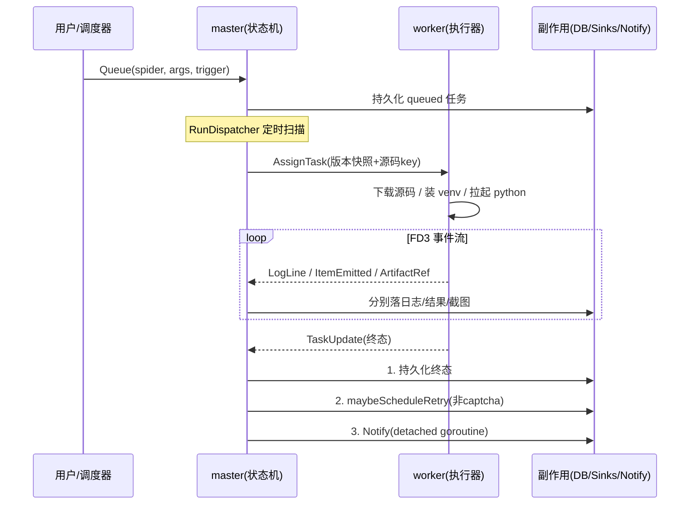

# crawler-lite 设计文档

> 本文讲系统的**设计意图与架构原则**，不逐文件罗列实现。配合 `CLAUDE.md` 的约定章节阅读。
> module path 仍为占位符 `github.com/yourteam/crawler-lite`，尚未改名。

---

## 1. 概述

crawler-lite 是一个面向 Python + Selenium 爬虫的**托管运行平台**。它要解决的核心问题是：把"一段会抓网页、会遇验证码、要定时跑、要把结果存下来"的爬虫脚本，变成一个可调度、可观测、可重试、可水平扩展的服务。

设计上它刻意分成两类职责截然不同的进程：

- **master**：系统的"大脑与门面"。唯一持有数据库连接、唯一对外暴露 API、唯一做调度决策。它不碰爬虫代码本身。
- **worker**：系统的"手脚"。只做一件事——按 master 的指令，在一个隔离的子进程里跑 spider 的 Python 代码，并把过程实时回传。worker 无状态、可随意水平扩展。

两者之间是**一条长连接双向 gRPC 流**，由 worker 主动连接（NAT 友好，worker 可在任意位置拉起）。这种"控制面（master）与执行面（worker）分离、用流式协议连接"的形态，是整个系统所有后续设计的起点。


信息流的方向是单向收敛的：**所有状态变更最终都汇集到 master 的任务状态机，所有执行都从 master 的调度决策流出**。worker 永远不直接写库、不直接接外部请求。

---

## 2. 设计原则

系统在多个层面反复践行同一条原则，理解它就能预测大部分实现选择：

> **每个横切关注点只有一个咽喉（chokepoint）。任何想绕过咽喉、新开第二条路径的代码都是 bug。**

这条原则派生出几个具体表现：

| 原则 | 落地 |
|---|---|
| 状态推进单入口 | 任务状态机只有 `task.OnUpdate` 一个入口；"第二处推进任务状态的地方就是 bug" |
| 顺序不可变 | `OnUpdate` 内部固定为：**持久化状态 → 重试决策 → 触发通知**，绝不可重排 |
| 副作用与主流程解耦 | 通知在 detached `context.Background()` goroutine 上跑，慢 webhook 不能反压状态落库 |
| 消费者声明接口 | 接口写在调用方而非实现方，使每个服务可就近用 inline mock 单测 |
| 控制面无状态执行面 | worker 不持业务状态，靠 `os.Hostname()` 兜底身份，`--scale worker=N` 即可扩容 |
| 前向不可逆 | 数据库迁移前向 only，跨边界回滚需手工介入 |

这条"咽喉"原则是系统可推理性的根基：因为每个关注点只有一条路径，调试时只需顺着那一条路径走，不必担心有旁路在悄悄改状态。

---

## 3. 进程与职责边界

### 3.1 master：控制面

master 把自己组织成一个**严格分层的构造根**（`app.Build`），自顶向下五段：基础设施 → 仓库 → 领域服务 → hub + sinks → 网络面。没有 DI 容器，构造函数手动注入依赖，读 `app.go` 即可看清谁依赖谁。

它承担四类职责：

1. **门面**：HTTP API + 内嵌 SPA（go:embed），含鉴权中间件。API 404 永远返回 JSON，SPA fallback 只对未匹配路由生效——二者绝不互相遮蔽。
2. **调度**：进程内 cron daemon，到点把"该跑的 spider"变成"queued 任务"交给状态机。
3. **状态机**：`task.OnUpdate` 是唯一推进点，串联状态持久化、重试决策、通知。
4. **分发**：`RunDispatcher` 定时泵扫 queued 任务，first-fit 分配给有空闲槽的 worker。

### 3.2 worker：执行面

worker 的生命周期很薄：连接循环（指数退避）→ 鉴权 Hello → 拿到 Welcome → 跑两个循环（心跳 + 收消息）+ 一个 outbox 通道。真正干活的是 `TaskExecutor`，它把"跑一段爬虫代码"这件事固化成一条标准流水线：

```
下载源码 zip → 解压到隔离工作目录 → 按 requirements 哈希装 venv
   → 拉起 python 子进程(FD3 当事件管道) → 泵事件 → 等退出 → 分类结局
```

两个关键设计：

- **venv 按 `requirements.txt` 哈希缓存**，per-hash 互斥锁串行化。相同依赖的 spider 复用同一个 venv，避免每次重装。
- **结局分类是纯函数**，且 **captcha 覆盖一切**：哪怕 Python 进程干净退出，只要事件流里出现过 captcha，就判为 `captcha_blocked`。因为 captcha 是操作员态问题，不是瞬时故障。

### 3.3 Python SDK：执行契约

master/worker 都是 Go，但跑的爬虫是 Python。两侧用一个**进程间契约**对接，而不是嵌入式解释器：

- 入口：`entry_module = "pkg.mod:ClassName"`，runner 反射加载
- 通信：**FD 3 上的 JSONL 事件流**，每行一个 `{type, data}`（log / item / shot / captcha）
- 配置：通过环境变量注入（任务 id、spider id、事件 fd、config、args）
- 退出码：约定 0/1/2/130 分别表示成功/未捕获异常/无入口/SIGINT

选 FD 3 而非 stdout，是为了把**结构化事件**和**人看的 print 日志**分到两条管道，互不污染。stdout 仍被 worker 收集转成 INFO 日志，让用户调试用的 `print()` 也能在 UI 看到。

---

## 4. 核心抽象

### 4.1 任务：系统的中心实体

任务是贯穿全系统的中心抽象。一个任务 = "在某版本 spider 上、以某参数、做一次运行尝试"。它的状态机有七个终态/中间态（queued → running → succeeded/failed/cancelled/timeout/captcha_blocked），触发方式四种（manual / schedule / retry / api）。

任务携带 `spider_version`——这是**不可变快照**语义：spider 源码可以随时 sync 更新，但已排队的任务始终跑它入队那一刻的版本。这让"边改爬虫边跑历史任务"不会产生不可复现的结果。

### 4.2 spider：可变定义 + 不可变快照

spider 本身是可变定义（名称、入口、git 源、config），但每次 sync 会产出新的 `source_version`，源码以 zip 形式存进 MinIO。任务引用版本号而非当前源码，于是"定义可变"与"执行可复现"两个诉求被解耦。

### 4.3 调度与任务的桥接

调度器不直接跑爬虫。它只做一件事：到点时调用任务状态机的 `Queue`，创建一个 `trigger=schedule` 的任务。**从这一刻起，调度触发的任务和人工点的任务走完全相同的链路**。这是"咽喉"原则的又一体现：调度只是任务的一种触发来源，不是一条独立执行路径。

### 4.4 重试：纯函数策略

重试决策被抽成纯函数 `Decide(attempt, errClass)`，输入是尝试次数与错误类别，输出是"是否重试 / 延迟多久"。**captcha 硬排除**——它不是瞬时故障，重试只会再次撞墙，必须人介入。把策略做成纯函数，意味着可以脱离整个运行时做确定性的单测，也意味着未来换策略只需替换这一个函数。

### 4.5 通知：终态订阅

通知系统订阅任务的终态事件（failed / timeout / captcha_blocked / 可选 succeeded），通过 shoutrrr 转发到 slack/telegram/discord 等。它挂在状态机的最后一步、跑在 detached goroutine 上——所以通知失败永远不会让一个本已成功的任务"看起来没成功"。

---

## 5. 存储分层：Postgres / Redis / MinIO 各司其职

系统用三个存储后端，按"该数据该被怎样读写"来分工，而非按子系统分工。三者职责正交、互不替代：换掉任何一个都会丢失一类语义。

### 5.1 分工总览

| 后端 | 角色 | 存什么 | 不存什么 |
|---|---|---|---|
| **Postgres** | 事实之源（source of truth） | 所有**可查询、需事务、需外键**的结构化状态 | 大块二进制、瞬态流 |
| **Redis** | 实时总线 | 日志的**实时发布/订阅**通道 | 持久状态（pubsub 是 fire-and-forget，不落盘语义） |
| **MinIO** | 对象仓库 | 源码 zip、日志 JSONL、截图/HAR 二进制 | 任何需索引/事务的元数据 |

一条朴素原则贯穿其间：**"master 永不触碰大块二进制"**。截图/HAR 的字节由 worker（或 Python SDK 直传）写进 MinIO，master 只在 Postgres 记一行元数据（key、尺寸、字节数）。源码 zip 同理——master sync 时上传，worker 执行时下载。这让 master 的内存与带宽不随产物体积增长。

### 5.2 Postgres：结构化状态的事实之源

Postgres 持有系统的全部可推理状态，分九张前向 only 的迁移（goose）。关键设计：

- **枚举类型而非字符串约束**：`task_status`、`task_trigger`、`spider_status` 等用 PG enum，让非法状态在数据库层就被拒，状态机的合法迁移集由类型本身保证。
- **状态机的时间戳由 SQL CASE 推导**：`SetStatus` 的 UPDATE 里，`started_at`/`finished_at` 不是 Go 层算好传进去，而是 `CASE WHEN status='running' THEN now()` 在 SQL 里推。这把"进入 running 必须打 started_at、进入终态必须打 finished_at"这条不变量下沉到 SQL，Go 层无法绕过。
- **JSONB 承载半结构化字段**：`config`、`stats`、`triggered_args`、`level_counts` 是 JSONB——字段尚未稳定时用 free-form map，换取 schema 灵活性，代价是无编译期校验（演进方向之一）。
- **`not_before` 表达重试退避**：`ListQueued` 的查询带 `not_before IS NULL OR not_before <= now()`，让"延迟重试"复用同一个 queued 池，无需单独的延迟队列。这是把重试策略的产物（一个时间点）塞进已有查询的优雅做法。
- **"0 表示未设置"约定**：仓库层 `nullableInt64/nullableStr` 在写入时把 `0`/`""` 强制成 `NULL`。这让 Go 层的零值与 DB 的 NULL 语义对齐，避免 `0` 被当成有效外键。
- **每个 repo 私有 `ErrNotFound`**：不集中化，`scanOne` 把 `pgx.ErrNoRows` 映射成本 repo 的 sentinel，handler 再 `errors.Is` 映射成 404。

仓库层是手工 pgx 查询（`repository.Repos` bag），但已把 SQL 留在 `db/queries/*.sql`、配好 `sqlc.yaml`——一旦手写 scan 的成本超过收益，可平滑切到 sqlc 而方法签名不变。

> **注意日志的例外**：日志的**正文**不进 Postgres。Postgres 只持有一张 `task_log_index`（主键 task_id），存 log_key、字节数、行数、每级计数的 JSONB 滚存——纯粹是为了 UI 能在日志对象还没写完时就能展示统计，而不必扫整个 MinIO 对象。

### 5.3 Redis：实时日志的发布/订阅总线

Redis 在当前阶段只承担一个职责：**任务实时日志的 pubsub 扇出**。`internal/cache` 包很薄，刻意不封装每个原语——`Raw()` 直接暴露 go-redis 客户端，只集中了通道命名格式 `tasks:%d:log`，让发布方（LogSink）和订阅方（WS handler）不必复制格式串。

数据流是双写的，但两条路语义不同：

```
worker LogLine ─► master LogSink.Write
                      ├─► Redis PUBLISH  (实时，fire-and-forget，无落盘)
                      └─► 内存 buffer ─► 每 3s 批量 flush ─► MinIO AppendJSONL (持久)
```

- **Redis 那条线只为"在线的浏览器"服务**：WS handler 先订阅 Redis 频道，再回放 MinIO 里的历史日志补齐断点，此后实时转发。订阅早于回放，避免回放期间的新行被漏掉。
- **pubsub 失败不阻断 sink**：`Publish` 出错只记过，buffer 照常进——因为 Redis 不保证持久，丢一条实时推送无伤，历史日志仍由 MinIO 兜底。
- **不把 Redis 当持久队列**：这是刻意的。需要可靠排队的是"任务本身"，那已经在 Postgres 的 queued 池里了；日志是可观测性的副产品，丢了能容忍，所以用 pubsub 而非 stream/list。

（包注释里提到 rate-limit token bucket 计划后续落在 Redis，当前未实现。）

### 5.4 MinIO：源码、日志与产物的对象仓库

MinIO 是唯一存字节的地方，按 key 前缀划分三类对象：

| key 前缀 | 内容 | 写入方 | 读取方 |
|---|---|---|---|
| `spiders/%d/source/v%d.zip` | spider 某版本源码 zip | master sync 时 | worker 执行时下载 |
| `tasks/%d/log.jsonl` | 任务完整日志（JSONL） | master LogSink 批量 flush | WS handler 回放历史、UI 滚日志 |
| 截图/HAR 的 storage_key | 产物二进制 | worker/SDK 直传（presigned PUT） | UI 经 presigned GET |

几个反映设计取舍的细节：

- **源码用版本号寻址**：key 里带 `v%d`，与任务引用的 `spider_version` 对应。旧版本永不覆盖，于是"跑历史任务"总能取到入队那一刻的源码——这是 4.2 节"可变定义 + 不可变快照"在存储层的落地。
- **日志用 read-modify-write 模拟 append**：MinIO 原生不支持 append，`AppendJSONL` 先下后拼再传。代码注释坦承这对 v1 日志量（每任务几 MB）可接受，日志变大后需 revisit——一个明确的、被记录的技术债边界。
- **截图/HAR 走 presigned URL 直传直取**：master `PresignPut` 给 SDK 上传、`PresignGet` 给浏览器下载，字节从不经过 master。`ArtifactRef` 帧只带 key/url/尺寸，master 据此在 Postgres 记元数据。
- **bucket 启动时自建**：`EnsureBucket` 让 dev 环境无需手工建桶，降低首次启动摩擦。

### 5.5 三者如何协作：一条日志的完整旅程

以"worker 产出一条日志"为例，看清三者如何接力：

1. worker 把 `LogLine` 经 gRPC 流发给 master。
2. master `LogSink.Write`：JSON 编码一次，**同时** `PUBLISH` 到 Redis（在线浏览器实时拿到）+ 攒进 per-task 内存 buffer。
3. 每 3 秒，flush goroutine 把 buffer 批量 `AppendJSONL` 到 MinIO 的 `tasks/%d/log.jsonl`，并 `UpsertLogIndex` 更新 Postgres 的行数/字节数/级别计数。
4. 浏览器打开任务页：WS handler 订阅 Redis（接后续新行）+ 从 MinIO 下载历史 JSONL 回放（补已发生的行）+ 从 Postgres 读 `task_log_index` 显示统计。

Redis 管"现在"，MinIO 管"过去"，Postgres 管"过去有多长"。三者各管一段，没有冗余职责，缺一不可。

---

## 6. 端到端信息流

一次完整的"定时抓取并通知"链路：



注意状态机内部那三步的顺序：**先落库，再决定重试，最后通知**。这个顺序保证了一致性——即使通知那一刻 master 崩了，任务的真实状态已经在库里，重启后 dispatcher 会把该重试的重新排进队列。

---

## 7. 横切关注点的咽喉汇总

| 关注点 | 咽喉 | 为何重要 |
|---|---|---|
| 任务状态推进 | `task.OnUpdate` | 唯一入口，保证状态/重试/通知顺序固定 |
| Python→Go 事件 | FD3 `pumpEvents` | 单一解析点，结构化与日志分流 |
| worker→master 消息 | 每 session 一个 `outbox chan` | 序列化 + 背压 |
| master←worker 消息 | `readLoop` | 单一读循环分发到各 sink |
| HTTP 响应 | `render` 包 | 唯一响应信封与错误格式 |
| DB 访问 | `repository.Repos` bag | 统一列常量 + scan 映射 |
| 前端 fetch | `api<T>()` | 唯一封装：注 token、抛 ApiError、401 登出 |

每一行都是"想加第二条路径时会被 review 拦下"的位置。

---

## 8. 部署形态

- **开发**：docker 起三件套（postgres/redis/minio），master/worker/web 各一终端，Vite 代理 `/api`（含 WebSocket）到 master。
- **生产**：同一份 compose 叠加 prod override；master 单实例（持有调度器与状态机），worker `--scale` 任意扩。
- **管理员**：无 UI，靠命令行哈希口令 + 手工 SQL 插入。

worker 无状态 + 主动连 master 的设计，让扩容变成纯粹的"多起一个副本"，无需改 master 配置、无需服务发现。
