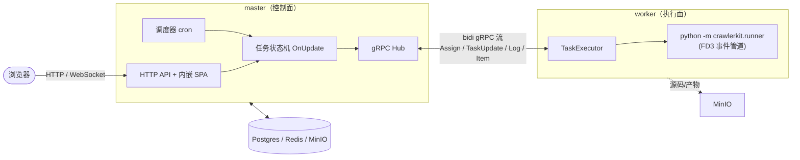
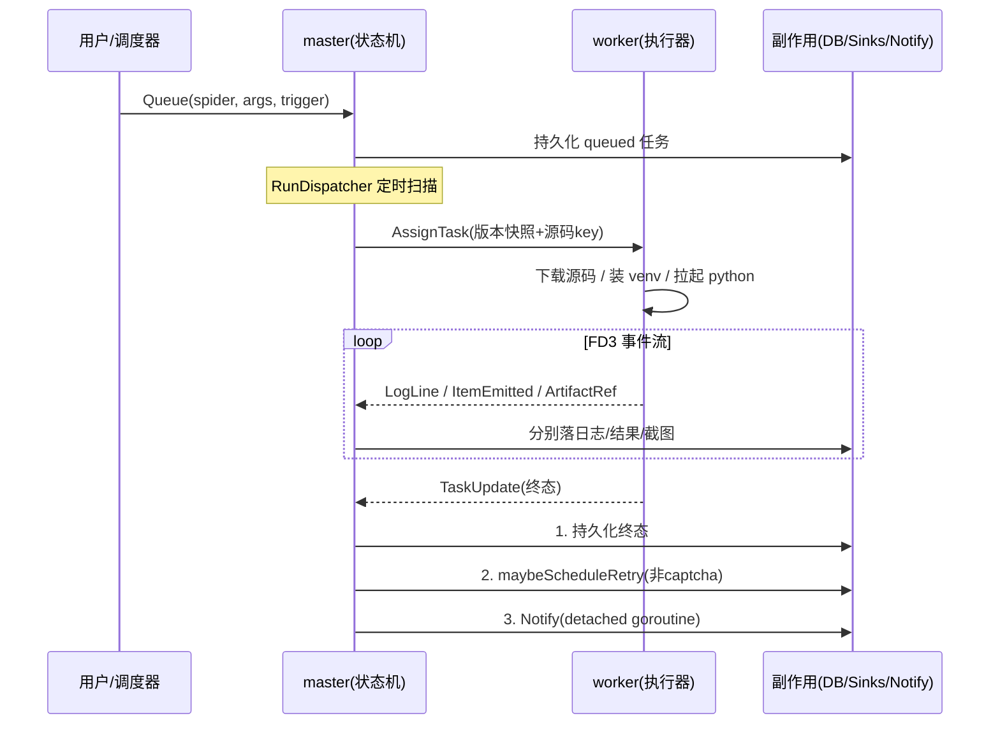

# crawler-lite 设计文档

> 这份文档讲的是 crawler-lite **为什么这么设计**，而不是逐文件罗列代码。读它像听作者把架构在白板上画一遍。配合 `CLAUDE.md` 的约定章节一起看更完整。
>
> 一个小提示：代码里的 module path 还是个占位符 `github.com/yourteam/crawler-lite`，没正式改名。

---

## 1. 概述

先说 crawler-lite 到底在解决什么问题。

写过爬虫的人都知道，一段"会抓网页、会撞验证码、想定时跑、要把结果留下"的脚本，和"一个能被团队依赖的爬虫服务"之间，隔着很远的距离。crawler-lite 想填的就是这道沟：把散落的脚本，变成可调度、可观测、可重试、能水平扩展的服务。

为了做到这件事，它从一开始就把世界劈成了两半——两个职责截然不同的进程：

- **master**，是整个系统的"大脑和门面"。数据库只有它连、API 只有它对外开、调度只有它说了算。但它**绝不亲手碰爬虫代码**。
- **worker**，是干活的"手脚"。它只听 master 的指令，在一个隔离的子进程里把 spider 的 Python 跑起来，再把过程实时传回去。worker 自己不带任何业务状态，想加机器随时加。

中间把它们连起来的，是**一条长连接的双向 gRPC 流**，而且是由 worker 主动连过来的。这个方向不是随便选的——worker 可能在 NAT 后面、可能在任意一台机器上，让它主动出击，部署就简单得多。

这套"控制面（master）和执行面（worker）分离、用流式协议串联"的形态，是后面几乎所有设计的起点。



有个方向感值得记住：信息流是**单向收敛**的。所有状态变更最终都汇到 master 的任务状态机这一个点上，所有执行都从 master 的调度决策流出来。worker 永远不直接写库，也不直接接待外部请求——它只对 master 这一个上游负责。

---

## 2. 设计原则

如果只能记住一句话，那就是这条：

> **每个横切关注点只有一个咽喉（chokepoint）。谁想绕过咽喉、另开一条路，那就是 bug。**

这话听起来抽象，但它能帮你预测系统里大部分的实现选择。它具体长这样：

| 原则 | 在代码里怎么落地 |
|---|---|
| 状态推进只有一个入口 | 任务状态机只认 `task.OnUpdate`；项目里常说"第二处推进任务状态的地方就是 bug" |
| 关键顺序不能动 | `OnUpdate` 内部永远是**先存状态、再决定重试、最后发通知**，这个顺序不可重排 |
| 副作用不能拖累主流程 | 通知跑在独立的 detached goroutine 上，一个慢吞吞的 webhook 绝不能卡住状态落库 |
| 接口由调用方来定义 | 谁用某个服务，接口就写在谁那边，这样每个服务都能就近用 mock 做单测 |
| 执行面不持有状态 | worker 靠 `os.Hostname()` 给自己起名，`--scale worker=N` 就能扩容，不用改 master 配置 |
| 数据库迁移只能向前 | 迁移是前向 only 的，真要回滚得人工介入 |

为什么这么执着于"咽喉"？因为它是**可推理性的根基**。每个关注点只有一条路，调试时顺着那一条走就行，不用时刻提防某条旁路在悄悄改状态。这是一种用纪律换简单性的选择。

---

## 3. 进程与职责边界

### 3.1 master：控制面

master 把自己组织成一个**严格分层的构造根**（`app.Build`），自顶向下五段清清楚楚：基础设施 → 仓库 → 领域服务 → hub + sinks → 网络面。这里没有 DI 容器，依赖都是构造函数手动塞进去的，打开 `app.go` 从上往下读，谁依赖谁一目了然。

它身上背着四件事：

1. **当门面**：HTTP API 加上内嵌的 SPA（用 go:embed 打进去），前面挡着鉴权中间件。这里有个细节很关键——API 的 404 永远返回 JSON，SPA 的 fallback 只对"没匹配上的路由"生效，两者各走各的，绝不互相遮蔽。
2. **做调度**：进程内跑着一个 cron daemon，到点就把"该跑的 spider"变成一个 queued 任务，交给状态机。
3. **守状态机**：`task.OnUpdate` 是唯一能推进任务状态的地方，它把状态持久化、重试决策、通知这三件事串成一条线。
4. **分发任务**：`RunDispatcher` 是个定时泵，扫 queued 任务，用 first-fit 的方式分给有空闲槽的 worker。

### 3.2 worker：执行面

worker 自己的生命周期其实很薄：连上 master（连不上就指数退避重试）→ 发个 Hello 鉴权 → 收到 Welcome → 然后就跑两个循环（一个发心跳、一个收消息）加一个 outbox 通道。真正干活的是 `TaskExecutor`，它把"跑一段爬虫代码"这件事固化成了一条标准流水线：

```
下载源码 zip → 解压到隔离工作目录 → 按 requirements 哈希装 venv
   → 拉起 python 子进程(FD3 当事件管道) → 泵事件 → 等退出 → 分类结局
```

这条流水线上有两个设计值得单独点出来：

- **venv 按 `requirements.txt` 的哈希缓存**，相同依赖的 spider 复用同一个 venv，靠一把 per-hash 的锁串行化安装。省掉了每次跑都重装依赖的开销。
- **结局分类是个纯函数，而且 captcha 一票否决**。哪怕 Python 进程干干净净退出了，只要事件流里出现过 captcha，就判成 `captcha_blocked`。理由很实在：captcha 是操作员要处理的状态，不是抖一抖就能过的瞬时故障。

### 3.3 Python SDK：执行契约

master 和 worker 都是 Go 写的，但真正跑的爬虫是 Python。这两侧怎么对接？crawler-lite 没有用嵌入式解释器，而是定了一个**进程间的契约**：

- **入口**：`entry_module = "pkg.mod:ClassName"`，runner 用反射把它加载起来
- **通信**：走 **FD 3 上的 JSONL 事件流**，每行一个 `{type, data}`，type 是 log / item / shot / captcha 之一
- **配置**：全部通过环境变量塞进去（任务 id、spider id、事件 fd、config、args）
- **退出码**：约定好了 0 成功 / 1 未捕获异常 / 2 没有入口 / 130 收到 SIGINT

为什么用 FD 3 而不是直接用 stdout？因为想把**结构化事件**和**给人看的 print 日志**分到两条管道里，免得互相污染。stdout 也没浪费——worker 照样收着，转成 INFO 日志，这样用户调试时随手写的 `print()` 在 UI 里也看得到。

---

## 4. 核心抽象

### 4.1 任务：整个系统的中心

任务是贯穿全系统的中心抽象。说白了，一个任务就是"在某个版本的 spider 上、用某组参数、做一次运行尝试"。它的状态机有七个状态（queued → running → succeeded/failed/cancelled/timeout/captcha_blocked），触发方式有四种（手动 / 调度 / 重试 / API）。

这里有个容易被忽略但很重要的设计：任务身上带着 `spider_version`，而且是**不可变快照**。意思是，spider 的源码你随时可以 sync 更新，但已经排进队的任务，跑的永远是它入队那一刻的版本。这样"边改爬虫边跑历史任务"才不会跑出无法复现的结果。

### 4.2 spider：定义可变，快照不可变

接上一节。spider 本身是个可变定义（名字、入口、git 源、config 都能改），但每 sync 一次就会产出一个新的 `source_version`，源码以 zip 存进 MinIO。任务引用的是版本号，不是"当前源码"。这样一来，"定义可以随时改"和"执行结果能复现"这两个本来打架的诉求，就被干净地解耦了。

### 4.3 调度器不直接跑爬虫

调度器自己不碰爬虫，它只做一件事：到点了，就调任务状态机的 `Queue`，创建一个 `trigger=schedule` 的任务。**从这个瞬间开始，调度触发的任务和用户手动点的任务，走的是完全一模一样的链路**。这正是"咽喉"原则的又一次体现——调度只是任务的一种触发来源，而不是另开的一条执行路径。

### 4.4 重试：一个纯函数

重试决策被抽成了一个纯函数 `Decide(attempt, errClass)`：输入尝试次数和错误类别，输出"要不要重试、延迟多久"。**captcha 是硬排除的**——它不是抖一抖就好的瞬时故障，重试只会再撞一次墙，必须人来介入。把这件事做成纯函数有两个好处：能脱离整个运行时做确定性的单测；将来想换策略，替换这一个函数就够了。

### 4.5 通知：只听终态

通知系统订阅的是任务的终态事件（failed / timeout / captcha_blocked，succeeded 可选），通过 shoutrrr 转发到 Slack、Telegram、Discord 之类的地方。它挂在状态机的最后一步，跑在独立的 detached goroutine 上——所以哪怕通知发失败了，也绝不会让一个本已成功的任务"看起来没成功"。状态在前，通知在后，这个先后永远不颠倒。

---

## 5. 存储分层：Postgres / Redis / MinIO 各司其职

系统用了三个存储后端，但分工的方式不是"按子系统切"，而是"按这份数据该怎么读、怎么写来切"。三者职责正交、互相不可替代——换掉任何一个，都会丢掉一类语义。

### 5.1 先看总览

| 后端 | 角色 | 存什么 | 不存什么 |
|---|---|---|---|
| **Postgres** | 事实之源 | 所有要**能查、要事务、要外键**的结构化状态 | 大块二进制、瞬态流 |
| **Redis** | 实时总线 | 日志的**实时发布/订阅**通道 | 持久状态（pubsub 是发完即忘，不保证落盘） |
| **MinIO** | 对象仓库 | 源码 zip、日志 JSONL、截图/HAR 的二进制 | 任何需要索引或事务的元数据 |

有一条朴素原则贯穿其间：**"master 永不触碰大块二进制"**。截图、HAR 的字节，是 worker（或 Python SDK 直传）写进 MinIO 的，master 只在 Postgres 里记一行元数据（key、尺寸、字节数）。源码 zip 也一样——master 在 sync 时上传，worker 在执行时下载。这么一来，master 的内存和带宽开销不会随着产物体积水涨船高。

### 5.2 Postgres：结构化状态的事实之源

Postgres 装着系统全部"可推理"的状态，用九张前向 only 的迁移（goose 管理）建起来。几个关键设计值得一说：

- **用枚举类型，而不是字符串约束**：`task_status`、`task_trigger`、`spider_status` 这些都用 PG 的 enum。好处是非法状态在数据库这一层就直接被拒了，状态机能合法地迁移到哪些状态，是由类型本身保证的，不是靠应用层自觉。
- **时间戳让 SQL 自己推**：`SetStatus` 那条 UPDATE 里，`started_at`/`finished_at` 不是 Go 算好了传进去的，而是 `CASE WHEN status='running' THEN now()` 在 SQL 里现推的。这等于把"进入 running 必须打 started_at、进入终态必须打 finished_at"这条不变量下沉到了 SQL 层，Go 层想绕都绕不过去。
- **半结构化字段用 JSONB**：`config`、`stats`、`triggered_args`、`level_counts` 都是 JSONB。字段还没稳定的时候，free-form 的 map 换来了 schema 的灵活性，代价是没有编译期校验。
- **用 `not_before` 表达重试退避**：`ListQueued` 的查询里带着 `not_before IS NULL OR not_before <= now()`。这一手很巧妙——"延迟重试"复用了同一个 queued 池，不用再单独搞一个延迟队列。重试策略的产物（一个时间点）被干净地塞进了已有的查询。
- **"0 就是没有"的约定**：仓库层有 `nullableInt64/nullableStr`，写入时把 `0`/`""` 强制成 `NULL`。这样 Go 的零值和 DB 的 NULL 语义对齐了，不会把 `0` 误当成一个有效的外键。
- **每个 repo 自己管自己的 `ErrNotFound`**：不集中化。`scanOne` 把 `pgx.ErrNoRows` 映射成本 repo 的 sentinel 错误，handler 再用 `errors.Is` 映射成 404。

顺带一提，仓库层现在是手写 pgx 查询（`repository.Repos` 这个 bag），但 SQL 已经留在 `db/queries/*.sql`、`sqlc.yaml` 也配好了。意思是等哪天手写 scan 的成本超过了收益，可以平滑切到 sqlc，而方法签名不用动。

> **日志是个例外**：日志的**正文**不进 Postgres。Postgres 里只有一张 `task_log_index`（主键是 task_id），存 log_key、字节数、行数、每级计数的 JSONB 滚存。它存在的唯一理由，是让 UI 在日志对象还没写完的时候就能展示统计，而不必去扫整个 MinIO 对象。

### 5.3 Redis：实时日志的发布/订阅总线

在当前阶段，Redis 只干一件事：**任务实时日志的 pubsub 扇出**。`internal/cache` 这个包很薄，而且是故意不封装每个原语的——`Raw()` 直接把 go-redis 客户端暴露出来，只集中管了通道命名的格式 `tasks:%d:log`，好让发布方（LogSink）和订阅方（WS handler）不用各自复制一遍格式串。

数据流是双写的，但两条路语义完全不同：

```
worker LogLine ─► master LogSink.Write
                      ├─► Redis PUBLISH  (实时，发完即忘，不落盘)
                      └─► 内存 buffer ─► 每 3s 批量 flush ─► MinIO AppendJSONL (持久)
```

- **Redis 那条线只为"此刻在线的浏览器"服务**：WS handler 先订阅 Redis 频道，再去 MinIO 回放历史日志补齐断点，之后实时转发。订阅必须早于回放，否则回放期间新来的行就漏掉了。
- **pubsub 失败不阻断 sink**：`Publish` 出了错只记一下，buffer 照样进。因为 Redis 本来就不保证持久，丢一条实时推送无所谓，历史日志还有 MinIO 兜底。
- **不拿 Redis 当持久队列**：这是刻意的。真正需要可靠排队的是"任务本身"，那已经在 Postgres 的 queued 池里了；日志只是可观测性的副产品，丢了能忍，所以用 pubsub 而不是 stream/list。

（包注释里提过一嘴，rate-limit 的 token bucket 以后也打算放 Redis，目前还没实现。）

### 5.4 MinIO：源码、日志和产物的对象仓库

MinIO 是整个系统里唯一存字节的地方，按 key 前缀分成三类对象：

| key 前缀 | 内容 | 谁写 | 谁读 |
|---|---|---|---|
| `spiders/%d/source/v%d.zip` | spider 某版本的源码 zip | master sync 时 | worker 执行时下载 |
| `tasks/%d/log.jsonl` | 任务的完整日志（JSONL） | master LogSink 批量 flush | WS handler 回放历史、UI 滚日志 |
| 截图/HAR 的 storage_key | 产物二进制 | worker/SDK 直传（presigned PUT） | UI 经 presigned GET |

几个能看出设计取舍的细节：

- **源码用版本号寻址**：key 里带着 `v%d`，正好对应任务引用的 `spider_version`。旧版本永远不会被覆盖，所以"跑历史任务"总能取到入队那一刻的源码——这就是 4.2 节"定义可变、快照不可变"在存储层的落地。
- **日志靠 read-modify-write 模拟 append**：MinIO 原生不支持 append，`AppendJSONL` 就先下载、再拼接、再传回去。代码注释很坦白：对 v1 的日志量（每任务几 MB）这是可接受的，日志真变大了他再改——一个被明确记录下来的技术债边界。
- **截图/HAR 走 presigned URL 直传直取**：master 给 SDK 签一个 `PresignPut` 上传、给浏览器签一个 `PresignGet` 下载，字节从头到尾不经过 master。`ArtifactRef` 帧里只带 key/url/尺寸，master 拿这些在 Postgres 记元数据。
- **bucket 启动时自建**：`EnsureBucket` 让 dev 环境不用先去手工建桶，降低第一次跑起来的摩擦。

### 5.5 三者怎么接力：跟一条日志走一遍

讲一千句不如跟着一条日志走一遍。假设 worker 刚产出一条日志，看三个后端怎么接力：

1. worker 把 `LogLine` 经 gRPC 流发给 master。
2. master 的 `LogSink.Write` 把它 JSON 编码一次，然后**同时**做两件事：`PUBLISH` 到 Redis（让在线浏览器立刻拿到），以及攒进 per-task 的内存 buffer。
3. 每过 3 秒，flush goroutine 把 buffer 批量 `AppendJSONL` 写进 MinIO 的 `tasks/%d/log.jsonl`，同时 `UpsertLogIndex` 更新 Postgres 里的行数、字节数、级别计数。
4. 浏览器打开任务页时：WS handler 订阅 Redis（接住后续新行）+ 从 MinIO 下载历史 JSONL 回放（补上已经发生的行）+ 从 Postgres 读 `task_log_index` 显示统计。

一句话概括：**Redis 管"现在"，MinIO 管"过去"，Postgres 管"过去有多长"**。三者各管一段，没有冗余职责，缺了谁都不行。

---

## 6. 端到端信息流

把上面所有东西串起来，看一次完整的"定时抓取并通知"链路：



请特别留意状态机内部那三步的顺序：**先落库，再决定重试，最后通知**。这个顺序不是随便排的，它保证了一致性——哪怕通知发到一半 master 崩了，任务的真实状态已经稳稳在库里了，重启之后 dispatcher 自然会把该重试的重新排进队列。状态永远比通知先落地，系统才敢在通知那一步放手用 detached goroutine。

---

## 7. 横切关注点的咽喉汇总

把全文散落的"咽喉"收到一张表里：

| 关注点 | 咽喉 | 为什么重要 |
|---|---|---|
| 任务状态推进 | `task.OnUpdate` | 唯一入口，保证状态/重试/通知的顺序固定 |
| Python→Go 事件 | FD3 `pumpEvents` | 单一解析点，结构化事件和日志分流 |
| worker→master 消息 | 每 session 一个 `outbox chan` | 序列化 + 背压 |
| master←worker 消息 | `readLoop` | 单一读循环，分发到各 sink |
| HTTP 响应 | `render` 包 | 唯一的响应信封和错误格式 |
| DB 访问 | `repository.Repos` bag | 统一的列常量 + scan 映射 |
| 前端 fetch | `api<T>()` | 唯一封装：注 token、抛 ApiError、401 登出 |

表里每一行，都是"谁想加第二条路径，就会被 review 拦下来"的位置。

---

## 8. 部署形态

- **开发**：docker 起三件套（postgres / redis / minio），master、worker、web 各开一个终端，Vite 把 `/api`（含 WebSocket）代理到 master。
- **生产**：同一份 compose 叠加一个 prod override；master 单实例（调度器和状态机都在它身上），worker 用 `--scale` 随意扩。
- **管理员**：没有 UI，靠命令行哈希口令 + 手工 SQL 插入。

最后一句话收尾：worker 无状态、又主动连 master，所以扩容这件事被简化成了"再多起一个副本"——不用动 master 配置，也不用服务发现。
